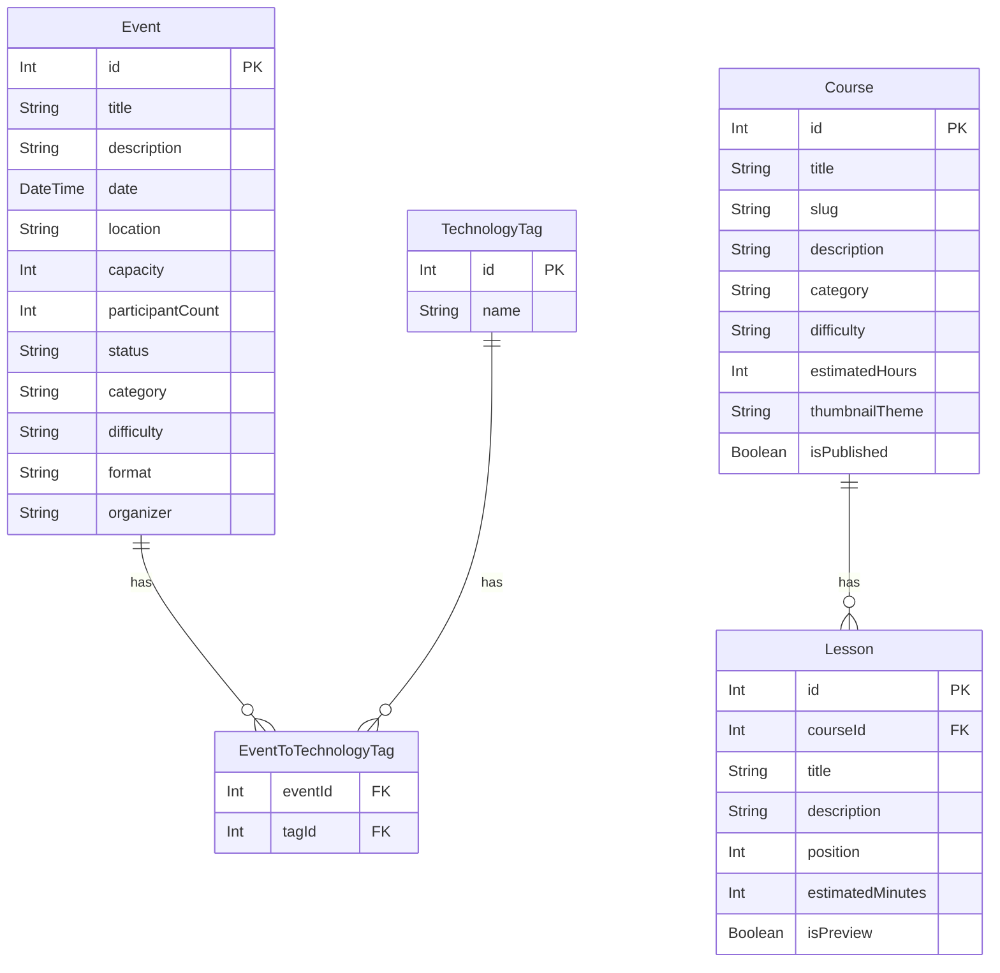

<!-- markdownlint-disable MD033 -->
# Dev Learning Hub

プログラミングを学びたい人のための、**学習プラットフォーム兼コミュニティ**です。
自分のペースで学べる**学習コース**と、オンライン・オフラインで参加できる**学習イベント（もくもく会・ハンズオン・交流会など）**を通して、一人でも挫折しにくい学習体験を目指しています。

> 個人開発の学習用ポートフォリオです。もともとは音楽コミュニティ向けのイベント管理アプリ「Music Event Hub」として実装したものを、既存のCRUD・Prisma・バリデーション・テスト資産を再利用しながら段階的にリブランディング／機能拡張しました（詳細は[今回のリファクタリング内容](#今回のリファクタリング内容)を参照）。

## 公開URL

- **Production**: <https://dev-learning-hub-two.vercel.app>

Productionはポートフォリオ公開用の**閲覧専用環境**です。学習イベントの作成・編集・削除はできません（変更系APIはアクセスすると403を返します）。イベントの作成・編集・削除の動作確認は、Preview環境またはローカル環境で行っています。

### デプロイ構成

- **ホスティング**: [Vercel](https://vercel.com/)
- **データベース**: Neon PostgreSQL（Vercel連携経由）
- **ORM**: [Prisma](https://www.prisma.io/)
- **CI**: GitHub Actions
- GitHubリポジトリとVercelを連携し、pushに応じてPreview／Production Deploymentが自動実行されます
- Production／Preview／Developmentのデータベースはそれぞれ分離されており、Preview環境での変更がProductionへ影響することはありません

## 開発背景

普段はプログラミング講師として、Vue.js・Ruby on Railsを中心に学習者の支援をしています。教材を使った個人学習のサポートを続ける中で、教材だけでは学習が長続きしない、あるいは一人で詰まったまま止まってしまう学習者を数多く見てきました。

一方で、定期的な質問会やもくもく会に参加している学習者ほど、学習を継続できている実感がありました。そこで、教材による自分のペースでの学習（学習コース）と、仲間と顔を合わせて手を動かす場（学習イベント）を1つのプラットフォームにまとめることで、「一人で学ぶ」と「仲間と続ける」を両立できる場を作りたいと考え、Dev Learning Hubを開発しました。

## 解決したい課題

- 教材があっても一人だと学習のモチベーションを維持しづらい
- 何を、どの順番で学べばいいか分からない（コースとして整理されていない）
- 初心者が気軽に参加できる学習会・勉強会を見つけにくい
- 技術カテゴリ・難易度・開催形式で学習イベントを絞り込めず、自分に合う会を探しにくい

## 対象ユーザー

- プログラミング初心者
- 独学中の学習者
- ポートフォリオを制作している人
- フロントエンドを学習したい人
- Ruby on Railsを学習したい人
- AWSへのデプロイを学習したい人
- 一緒に学ぶ仲間を探している人

## 使用技術

| カテゴリ | 技術 |
|---|---|
| フレームワーク | [Next.js 16](https://nextjs.org/)（App Router / Turbopack） |
| UIライブラリ | [React 19](https://react.dev/) |
| 言語 | TypeScript 5（`strict` モード） |
| スタイリング | [Tailwind CSS v4](https://tailwindcss.com/)（CSSベースの`@theme`設定） |
| ORM | [Prisma 7](https://www.prisma.io/)（Driver Adapter方式） |
| データベース | SQLite（`better-sqlite3` ドライバ経由） |
| バリデーション | [Zod](https://zod.dev/)（クライアント・サーバー共有スキーマ） |
| テスト | [Vitest](https://vitest.dev/) |
| Lint | ESLint（`eslint-config-next`） |
| パッケージ管理 | npm |

## 主な機能

- **トップページ**（`/`）: サービス紹介、特徴、おすすめ学習コース、開催予定の学習イベント、学べる技術カテゴリ、CTA
- **学習コース一覧・詳細**（`/courses`, `/courses/[slug]`）: コースの閲覧、キーワード・カテゴリ・難易度での絞り込み
- **学習イベント一覧・詳細**（`/events`, `/events/[id]`）: カード形式の一覧、フリーワード検索、カテゴリ・難易度・開催形式・募集状況・技術タグでの絞り込み（複数条件の組み合わせ対応）
- **学習イベント登録・編集・削除**（`/events/new`, `/events/[id]/edit`）: 必須入力・数値・候補値チェック、エラーメッセージ、二重送信防止
- **API（Route Handlers）**: `GET/POST /api/events`、`GET/PUT/DELETE /api/events/[id]`

### 学習コース機能

コースは「コース（Course）」と「レッスン（Lesson）」の1対多構造です。今回は**閲覧のみ**（登録・編集・削除・受講・進捗保存は対象外）で、以下を提供します。

- コース名・概要・カテゴリ・難易度・学習時間の目安・レッスン数を一覧表示
- 詳細ページでレッスン一覧（所要時間・プレビュー可否つき）を表示
- キーワード・カテゴリ・難易度による絞り込み、0件時の空状態表示
- 「学習を始める」ボタンは、受講・進捗保存機能が未実装であることが分かるよう**無効化した状態で明示**（意味のない動くふりをしたボタンにしない）
- 存在しない`slug`はNot Found

### 学習イベント機能

音楽コミュニティ向けアプリだった頃の`Event`モデルをそのまま拡張し、プログラミング学習イベント用に項目を追加しています（既存のCRUD・API・バリデーション・テストを再利用）。

- `category`（学習カテゴリ）・`difficulty`（難易度）・`format`（開催形式）・`organizer`（主催者名）・`technologyTags`（技術タグ、多対多）を追加
- フリーワード検索・カテゴリ・難易度・開催形式・募集状況（募集中／受付終了）・技術タグを組み合わせて絞り込み可能
- 絞り込み解除ボタンで検索条件を一括クリア
- 検索UIはClient Component（`EventSearch`）、データ取得・初期表示はServer Componentという役割分担

## 画面一覧

| 画面 | URL | 種別 |
|---|---|---|
| トップページ | `/` | Server Component |
| 学習コース一覧 | `/courses` | Server Component + 検索UI(Client) |
| 学習コース詳細 | `/courses/[slug]` | Server Component |
| 学習イベント一覧 | `/events` | Server Component + 検索UI(Client) |
| 学習イベント詳細 | `/events/[id]` | Server Component + 削除ボタン(Client) |
| 学習イベント登録 | `/events/new` | フォーム(Client) |
| 学習イベント編集 | `/events/[id]/edit` | フォーム(Client) |
| Not Found | （該当なしの全ルート） | Server Component |

## API一覧

学習コースのAPIは今回のスコープ外です（一覧・詳細ページからServer Component経由で直接Prismaを呼び出しています）。

| メソッド | パス | 概要 | 正常系 | 主なエラー |
|---|---|---|---|---|
| GET | `/api/events` | 学習イベント一覧取得（`q`/`category`/`difficulty`/`format`/`status`/`tag`で絞り込み） | 200 | - |
| POST | `/api/events` | 学習イベント作成 | 201 | 400（バリデーションエラー） |
| GET | `/api/events/[id]` | 学習イベント詳細取得 | 200 | 404（存在しないid） |
| PUT | `/api/events/[id]` | 学習イベント更新（技術タグは`set`で全置換） | 200 | 400 / 404 |
| DELETE | `/api/events/[id]` | 学習イベント削除 | 200 | 404 |

## DB設計

### Event（学習イベント）

`status`・`category`・`difficulty`・`format`はSQLiteにネイティブenum型が無いため、あえてPrisma enumを使わず**文字列カラム＋TypeScript union定数**で管理しています（`src/types/event.ts` / `src/types/learning.ts`）。将来PostgreSQLへ移行する際も、この設計ならスキーマ変更なしでenum化を検討できます。

| カラム | 型 | 備考 |
|---|---|---|
| id | Int | PK |
| title / description / location | String | |
| date | DateTime | |
| capacity / participantCount | Int | |
| status | String | `"RECRUITING" \| "CLOSED"` |
| category | String | `LearningCategory`（Ruby, AWS, Vue.js…） |
| difficulty | String | `LearningDifficulty`（初心者〜上級、レベル不問） |
| format | String | `"オンライン" \| "オフライン" \| "ハイブリッド"` |
| organizer | String | 主催者名 |
| technologyTags | TechnologyTag[] | 多対多（下記） |

### TechnologyTag（技術タグ）と多対多の設計判断

技術タグは`TechnologyTag`モデルとの多対多リレーションで表現しています。

- **採用した設計**: Prismaの**暗黙的多対多リレーション**（`Event.technologyTags TechnologyTag[]` / `TechnologyTag.events Event[]`）。Prismaが中間テーブル（`_EventToTechnologyTag`）を自動生成し、`connect`（作成時）／`set`（更新時、タグ一覧を丸ごと置き換え）だけで完結します。
- **検討した代替案**: 中間テーブルを`EventTechnologyTag { eventId, tagId, @@id([eventId, tagId]) }`のように明示的なモデルとして定義する方法。付与日時などの追加カラムを将来持たせやすい利点はありますが、今回はその要件がなく、クエリ・フォーム側の実装が一段複雑になります。
- **判断**: SQLiteは暗黙的多対多リレーション自体に制約はない（enumが使えないのとは別の話）ため、今回はシンプルさを優先して暗黙的多対多を採用しました。技術タグは`TECHNOLOGY_TAGS`という固定候補リスト（`src/types/learning.ts`）で管理し、フォームのチェックボックス・検索UIのフィルタチップ・シードデータで同じ配列を共有しています。

### Course（学習コース）/ Lesson（レッスン）

CourseとLessonは1対多です。`slug`は`@unique`制約付きで、詳細ページのURL（`/courses/[slug]`）に使います。`Lesson.position`は`@@unique([courseId, position])`でコース内の重複順序を防いでおり、詳細ページ・シードともに常に`position`昇順でレッスンを取得します。

| モデル | 主なカラム |
|---|---|
| Course | id, title, slug(unique), description, category, difficulty, estimatedHours, thumbnailTheme, isPublished, createdAt, updatedAt |
| Lesson | id, courseId(FK), title, description, position, estimatedMinutes, isPreview, createdAt, updatedAt |

### ER図



`EventToTechnologyTag`はPrismaが自動生成する暗黙的な中間テーブル（`_EventToTechnologyTag`）を表しており、独立したPrismaモデルとしては定義していません。

## Server ComponentとClient Componentの使い分け

App Routerでは**すべてのコンポーネントがデフォルトでServer Component**です。ファイル先頭に`"use client"`を書いたときだけ、そのコンポーネント（と子コンポーネント）がブラウザ側でも実行されます。このアプリでは「ブラウザ側の状態管理やイベントハンドラが必要かどうか」だけを基準に分けています。

| コンポーネント | 種別 | 理由 |
|---|---|---|
| `Header` / `Footer` / トップページ | Server | 静的な表示のみで、状態もイベントハンドラも不要 |
| `HeaderNav` | **Client** | `usePathname()`で現在地を判定し、モバイルメニューの開閉stateを持つ |
| `/courses`・`/events`（一覧ページ本体） | Server | Prismaで直接DBを検索し、結果をHTMLとして返すだけ |
| `EventCard` / `CourseCard` / `EventList` / `CourseList` / 各種Badge | Server | propsを受け取って表示するだけの「dumbコンポーネント」 |
| `/courses/[slug]`・`/events/[id]`（詳細ページ本体） | Server | データ取得と表示のみ |
| `EventSearch` / `CourseSearch` | **Client** | 入力値をstateで保持し、URLのクエリパラメータを書き換える |
| `EventForm` | **Client** | フォーム入力のstate管理、バリデーション、`fetch`によるAPI呼び出し |
| `DeleteEventButton` | **Client** | 確認ダイアログとクリックイベント、削除APIの呼び出し |

**ポイント**: ページ全体を`"use client"`にするのではなく、インタラクティブな部分だけを最小単位で切り出しています。`Header`も、現在地ハイライトとモバイルメニューだけを`HeaderNav`という小さなClient Componentに分離することで、ブランドロゴ部分は引き続きサーバーでレンダリングされます。

## Vue.jsとの主な違い

| 観点 | Vue.js（SPA） | Next.js（App Router） |
|---|---|---|
| コンポーネントの実行場所 | 常にブラウザ | **デフォルトはサーバー**。`"use client"`を書いたものだけブラウザでも実行 |
| データ取得 | `onMounted` + `fetch`やPinia store、あるいは別途SSRフレームワーク（Nuxt）が必要 | Server Componentの中で直接`await prisma.event.findMany()`のようにDBへアクセスできる |
| ルーティング | `vue-router`にルート定義を集約 | `app/courses/[slug]/page.tsx`のような**ファイル・ディレクトリ構造そのものがルーティング定義** |
| URLパラメータ | `route.params`で同期的に取得可能 | `params` / `searchParams`は**Promise**で、`await`が必須（ストリーミングを可能にするための設計） |
| リアクティブな状態 | `ref` / `reactive` + `watch` | `useState` + `useEffect`。「値が変わったら副作用を実行する」考え方は共通だが、依存配列を手動で書く必要がある |
| 現在ルートの判定 | `useRoute().path`をcomputedで参照 | `usePathname()`をClient Componentで呼ぶ（`HeaderNav`） |
| グローバルなインスタンス管理 | Piniaストアが暗黙的にシングルトン | `PrismaClient`を`globalThis`に自前で保存し、開発時のホットリロードで再生成されないようにする必要がある（[`src/lib/prisma.ts`](src/lib/prisma.ts)） |
| スタイル設定 | Tailwind v3までは`tailwind.config.js`（JS） | Tailwind v4は`globals.css`内の`@theme`ディレクティブ（**CSSベース**）でトークンを定義 |
| APIとページの関係 | 別リポジトリ/別プロセスのAPI（Rails等）を`fetch` | Server Componentから直接DBを読み書きでき、`app/api/`（Route Handlers）は「外部公開用API」として別途用意する構成 |

一番の感覚の違いは、**「このコンポーネントはどこで動くのか」を常に意識する必要がある**ことです。Vue.jsではコンポーネントはすべて等しく「ブラウザで動くもの」でしたが、Next.jsではServer Componentがデフォルトであり、「本当にブラウザで動かす必要があるか？」を都度問い直す設計になっています。

## Railsとの違い

| 観点 | Ruby on Rails | Next.js（App Router） |
|---|---|---|
| ルーティング定義 | `config/routes.rb`に集約 | `app/`配下のディレクトリ構造そのものがルート（`events/[id]/edit/page.tsx`など） |
| コントローラ | `EventsController#index`などのアクション | Server Componentのページ自体がデータ取得＋表示を兼ねる。`app/api/`のRoute Handlersが「外部公開用API」相当 |
| モデルのバリデーション | `ActiveModel::Validations`（`validates :capacity, numericality: ...`） | Zodスキーマ（`src/lib/validation.ts`）をクライアント・サーバーで共有。フォームとAPIの両方から同じスキーマを呼ぶ |
| Enum | `enum status: { recruiting: 0, closed: 1 }` | SQLiteにenum型が無いため、文字列カラム＋TS unionで手動管理（`src/types/event.ts` / `learning.ts`） |
| N対Nリレーション | `has_many :technology_tags, through: :event_technology_tags` | Prismaの暗黙的多対多（`TechnologyTag[]`同士の宣言のみ）。中間テーブルはPrismaが自動生成 |
| ビュー | ERB / Haml + ヘルパーメソッド | JSX（TSX）+ Tailwindのユーティリティクラス |
| 404処理 | `rescue_from ActiveRecord::RecordNotFound` | `notFound()`関数を呼ぶと最も近い`not-found.tsx`がレンダリングされる |
| マイグレーション | `rails generate migration` → `rails db:migrate` | `prisma migrate dev`（スキーマファイルの差分から自動生成） |
| シード | `db/seeds.rb` + `rails db:seed` | `prisma/seed.ts` + `npm run db:seed`（Prisma 7からは自動実行されないため明示的な実行が必要） |

Railsに近いと感じたのは、「モデル定義（`schema.prisma`）から関連クエリの型が自動生成される」体験です。一方で、Railsの`db:seed`が`db:migrate`後に自動実行される場合があるのに対し、Prisma 7はシードを完全に切り離しており、常に`npm run db:seed`を明示的に実行する必要がある点は明確な違いです。

## セットアップ手順

### 前提

- Node.js **24.19.0以降**（`nvm install`で`.nvmrc`のNode 24.19.0を利用できます）
- npm

```bash
# Node バージョンを合わせる（nvm利用時）
nvm use

# 依存パッケージのインストール
# postinstallでPrisma Clientの生成（npx prisma generate）も自動実行されます
npm install

# 環境変数ファイルを用意
cp .env.example .env
```

### migration・seed手順

SQLiteはファイルベースのDBなので、追加のミドルウェア起動は不要です。

```bash
# マイグレーションを適用してDBファイル（prisma/dev.db）を作成・更新
npm run db:migrate

# 学習イベント・学習コース・レッスン・技術タグのデモデータを投入
npm run db:seed
```

> **Prisma 7の注意点**: v6までと異なり、`prisma migrate dev`はクライアント自動生成もシード自動実行も**行いません**。`npm install`（`postinstall`）でクライアント生成、`npm run db:seed`でシードを、それぞれ明示的に実行する必要があります。

> **今回のマイグレーションについて**: 音楽イベントアプリからのリブランディングにあたり、既存の`Event`テーブルへ`category`/`difficulty`/`format`/`organizer`カラムと`TechnologyTag`との多対多リレーションを追加し、新たに`Course`/`Lesson`テーブルを作成しました。新規カラムにはすべて既定値（`@default(...)`）を設定しているため、既存の`Event`データは失われません（実際に移行時、既存6件のイベント行がすべて保持されたことを確認済みです）。その上で`prisma/seed.ts`を実行し、デモデータを音楽イベントからプログラミング学習イベント・学習コースへ入れ替えています。

DBの中身をリセットしたい場合:

```bash
npm run db:reset   # migrate reset（DB再作成 + マイグレーション再適用）
npm run db:seed    # シードは reset 後も自動実行されないため個別に実行
```

Prisma Studio（GUIでDBの中身を見る）:

```bash
npm run db:studio
```

## 起動方法

```bash
npm run dev
```

[http://localhost:3000](http://localhost:3000) を開いてください。3000番が使用中の場合は`npm run dev -- -p 3100`のようにポートを指定できます。

## テスト・Lint・型チェック・buildの実行方法

```bash
# 型チェック（tsc --noEmit）
npm run typecheck

# ESLint
npm run lint

# 単体テスト（Vitest）
npm run test

# 単体テスト（watchモード）
npm run test:watch

# 本番ビルド
npm run build

# 本番ビルドの起動確認
npm run start
```

### テストのスコープについて

`src/**/*.test.ts`に、以下の単体テストを置いています。

- **バリデーション**（`src/lib/validation.test.ts`）: 学習イベントの必須項目、カテゴリ・難易度・開催形式・技術タグが固定候補内かどうか、定員・日時の形式チェックなど
- **募集状況・フォーマット関連のロジック**（`src/lib/events.test.ts`）: 募集状況の導出、日時フォーマット変換
- **学習イベントの検索・絞り込み**（`src/lib/event-filters.test.ts`）: キーワード・カテゴリ・難易度・開催形式・募集状況・技術タグの単独／組み合わせ絞り込み
- **学習コースの取得・検索・絞り込み**（`src/lib/course-queries.test.ts`）: slugでの取得成功／存在しないslug、レッスンの`position`順での取得、キーワード・カテゴリ・難易度での絞り込み
- **APIの正常系・400・404**（`src/app/api/events/route.test.ts`, `src/app/api/events/[id]/route.test.ts`）: Route Handler（`GET`/`POST`/`PUT`/`DELETE`）を直接importし、Prismaをモックした状態で呼び出して検証

Route HandlerのテストはNext.jsのRoute Handlersが「`NextRequest`を受け取り`NextResponse`を返す、ただの非同期関数」であることを利用し、実サーバーを起動せずにテストランナーから直接呼び出しています（`@/lib/prisma`をインメモリのフェイク実装に差し替え）。実DBやテスト用サーバーの起動が不要なぶん高速で、CIでも安定して動作します。

Server/Client ComponentのレンダリングテストやE2Eテスト（Playwright等）は、Prismaのモックやブラウザ操作の自動化など**セットアップコストが本アプリの規模に見合わない**と判断し、今回もスコープ外としています（詳細は[今後のロードマップ](#今後のロードマップ)）。

## ディレクトリ構成

```text
dev-learning-hub/
├── prisma/
│   ├── schema.prisma          # Event / TechnologyTag / Course / Lesson モデル定義
│   ├── seed.ts                 # 学習イベント・学習コース・レッスンのシードデータ
│   └── migrations/             # マイグレーション履歴
├── src/
│   ├── app/
│   │   ├── page.tsx                    # トップページ
│   │   ├── layout.tsx                  # 共通レイアウト（Header/Footer組み込み）
│   │   ├── not-found.tsx               # 404ページ
│   │   ├── globals.css                 # Tailwind v4のテーマ定義（@theme）
│   │   ├── courses/
│   │   │   ├── page.tsx                # 学習コース一覧（検索・絞り込み対応）
│   │   │   └── [slug]/page.tsx         # 学習コース詳細
│   │   ├── events/
│   │   │   ├── page.tsx                # 学習イベント一覧（検索・絞り込み対応）
│   │   │   ├── new/page.tsx            # 学習イベント登録
│   │   │   └── [id]/
│   │   │       ├── page.tsx            # 学習イベント詳細
│   │   │       └── edit/page.tsx       # 学習イベント編集
│   │   └── api/
│   │       └── events/
│   │           ├── route.ts            # GET / POST /api/events（+テスト）
│   │           └── [id]/route.ts       # GET / PUT / DELETE /api/events/[id]（+テスト）
│   ├── components/
│   │   ├── layout/
│   │   │   ├── Header.tsx              # Server（薄いラッパー）
│   │   │   ├── HeaderNav.tsx           # "use client"（現在地ハイライト・モバイルメニュー）
│   │   │   └── Footer.tsx
│   │   ├── common/
│   │   │   ├── SectionHeading.tsx
│   │   │   ├── EmptyState.tsx
│   │   │   ├── TagBadge.tsx
│   │   │   ├── DifficultyBadge.tsx
│   │   │   └── SearchFilter.tsx        # 検索UIの共通シェル
│   │   ├── events/
│   │   │   ├── EventCard.tsx / EventList.tsx / EventStatusBadge.tsx
│   │   │   ├── EventSearch.tsx         # "use client"
│   │   │   ├── EventForm.tsx           # "use client"
│   │   │   └── DeleteEventButton.tsx   # "use client"
│   │   └── courses/
│   │       ├── CourseCard.tsx / CourseList.tsx / CourseDifficultyBadge.tsx
│   │       ├── CourseSearch.tsx        # "use client"
│   │       └── LessonList.tsx
│   ├── lib/
│   │   ├── prisma.ts             # PrismaClientシングルトン（+ SQLite driver adapter）
│   │   ├── events.ts             # 募集状況の導出・日付フォーマット・行の型ナローイング
│   │   ├── event-queries.ts      # id指定での学習イベント取得（詳細・編集ページ共通）
│   │   ├── event-filters.ts      # 検索・絞り込みロジック（ページ・APIで共有）
│   │   ├── course-queries.ts     # 学習コースの取得・検索・絞り込み
│   │   ├── difficulty.ts / course-theme.ts  # バッジ・カード配色の共有マッピング
│   │   ├── validation.ts         # Zodスキーマ（クライアント・サーバー共有）
│   │   └── test-support/event-factory.ts   # テスト用フィクスチャ
│   └── types/
│       ├── learning.ts           # カテゴリ・難易度・開催形式・技術タグの共有定数
│       ├── event.ts              # EventRecord / EventFormInput 等
│       └── course.ts             # CourseRecord / LessonRecord 等
└── vitest.config.mts
```

## 今後のロードマップ

今回スコープ外とした機能です。優先度が高いと考えている順に記載しています。

1. **ユーザー認証**（NextAuth等）— コース受講・イベント参加申し込みの前提として必要
2. **学習イベントの参加申し込み（RSVP）**— 現在`participantCount`はシードデータ・手動更新のみ
3. **学習進捗の保存**— コース詳細の「学習を始める」ボタンから、レッスン単位の完了状態を記録できるようにする
4. **コメント・チャット機能**— 学習会・コースへの質問やフィードバックのやり取り
5. **管理者権限**— コース・レッスンの作成・編集・公開管理をUIから行えるようにする
6. **決済機能**— 有料コースへの対応
7. **DBレベルでの検索・絞り込み**— 現状は全件取得後にアプリケーション側でフィルタリング。データ量が増えた場合はSQLクエリ側での絞り込み・ページネーションに切り替える
8. **PostgreSQLへの移行**— SQLite固有機能（enum非対応など）を避ける設計にしてあるため、`prisma/schema.prisma`の`datasource`と`@prisma/adapter-pg`への切り替えで移行できる想定
9. **Vercel等へのデプロイ**— 現状はローカル開発のみ
10. **E2Eテストの追加**— Playwright等を用いた、実際のブラウザ操作を伴う一連のシナリオテスト

## 技術的に工夫した点

- **既存資産の再利用を優先したリファクタリング**: `Event`モデルを安易にリネーム・再作成せず、フィールド追加とクエリ・コンポーネントの拡張で対応しました。既存のバリデーション・API・テストの設計パターン（Zodスキーマの共有、Route Handlerの構造、`toEventRecord`によるナローイング）をそのまま踏襲し、学習コース機能にも同じパターン（`course-queries.ts`、`filterCourses`）を横展開しています。
- **SQLiteとPostgreSQL移行を見据えたenum非依存設計**: `status`/`category`/`difficulty`/`format`をすべて文字列カラム＋TypeScript union定数で管理し、Prisma enumに依存しない設計を維持しました。
- **多対多リレーションのトレードオフを明示した設計判断**: 技術タグは暗黙的多対多を採用し、明示的な中間テーブルモデルとの比較・判断根拠を[DB設計](#db設計)に明記しました。
- **検索・絞り込みロジックの一本化**: `/events`ページと`GET /api/events`が同じ`filterEvents`（`src/lib/event-filters.ts`）を共有し、両者の絞り込み条件が乖離しないようにしています。
- **Route Handlerの単体テスト**: 実サーバーを起動せず、Prismaをモックした状態でRoute Handler関数を直接呼び出すことで、正常系・400・404を高速に検証できるようにしました。

## 今回のリファクタリング内容

- サービス名・文言・デザインを「Music Event Hub（音楽イベント管理アプリ）」から「Dev Learning Hub（プログラミング学習プラットフォーム）」へ全面リブランディング
- `Event`モデルに`category`/`difficulty`/`format`/`organizer`/`technologyTags`を追加（モデル名は維持、既存データは保持したまま追加専用マイグレーションで移行）
- `TechnologyTag`モデルと暗黙的多対多リレーションを新設
- `Course`/`Lesson`モデルと、学習コース一覧・詳細ページを新設
- 学習イベントの検索・絞り込みを、キーワードのみから「キーワード＋カテゴリ＋難易度＋開催形式＋募集状況＋技術タグ」の複数条件対応に拡張
- 音楽イベントのシードデータを、プログラミング学習イベント8件・学習コース8件（レッスン計33件）に刷新
- Header/Footer/トップページ/検索UI/カラーパレットをプログラミング学習サービス向けに刷新
- テストを19件から69件に拡張（バリデーション・検索絞り込み・コース取得・APIの正常系/400/404を追加）

## スクリーンショット

<!--
実際に `npm run dev` で起動し、以下の画面のスクリーンショットをここに追加してください。
- トップページ
- 学習コース一覧・詳細
- 学習イベント一覧（検索・絞り込み含む）
- 学習イベント詳細・登録フォーム（バリデーションエラー表示時）
- モバイル表示
-->

| 画面 | スクリーンショット |
|---|---|
| トップページ | _(準備中)_ |
| 学習コース一覧・詳細 | _(準備中)_ |
| 学習イベント一覧 | _(準備中)_ |
| 学習イベント詳細・登録フォーム | _(準備中)_ |
